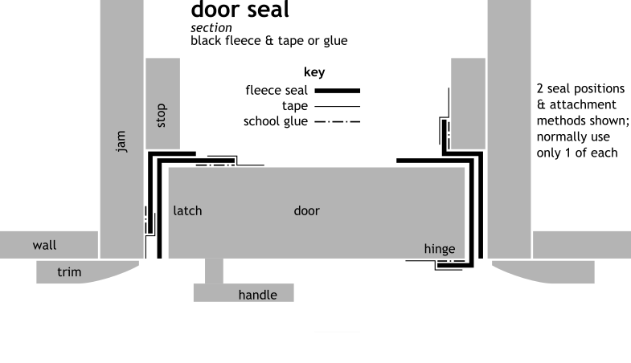

There is darkness, and then there is _darkness_. We're going for the second kind: perfect and absolute. There is a million-percent difference between 99% and 100% dark. Then the mind has nothing left to hold onto, no reason to resist. Finally it can let go, fall into the well of itself, and be renewed.

Though often easier to deal with than ventilation, light is relentless. It sneaks sideways through a single layer of clear plastic tape; through heavy fabric; around multiple, darkened corners; and at joints and edges of everything. After suffering many defeats at its hands, I have developed equally formidable means of eliminating it. I will now bestow them upon you so that you, too, can become a Conan the Barbarian of lightproofing.

Generally, to darken a space,

1. use dense inherently lightproof sheet material in 1-2 layers to cover area 
2. use soft black fabric or black adhesive tape to seal edges
3. outer surfaces exposed to sun should be reflective: white or silver
4. in vents, channel light around several dark-surfaced corners

Usually, using fewer layers means:

- easier, more reliable operation
- better function
- neater appearance
- greater need for precision

If improvising: use many layers. With each layer, block as much light as close to the source as possible. First, block 99% the light. Then 99% of what's left. Then the last 0.01% is easier to address. Close any curtains in rooms or hallways outside a darkroom's door. Where possible, prevent direct sunlight from hitting your darkening measures. 

Edges are tricky. Black polar fleece is the best thing I have found for sealing edges. It's like a sponge for light. It is widely available, cheap, and forgiving. A knit fabric, its edges require no hem. Just cut and attach with school glue or tape.

We will start with the simplest and most portable design, which darkens the small space immediately around the eyes: the sleeping mask.

#### sleeping mask

  

The quickest way to obtain a large measure of darkness wherever you are is to cover your eyes with a good sleeping mask. No mask is comfortable for long periods while blocking all light and staying in place. And our skin has enough light-receptors for it to wake us up. So it doesn't replace a darkroom. But it is cheap, quick, accessible, discreet, and very effective for immediately improving sleep. It is a good first step into the profound rest darkness makes possible.

I have not tried every mask on the market. But none has satisfied my requirements. So I designed one. Standard and instant versions.

##### constraints

- blocks all light 
    - through the mask
    - at its edges
- comfortable for many hours
- stays in place during sleep and gentle activity
- cheap and simple to make

Some measurements in the drawing are marked with a tilde (~). This means they are adjustable. I have not developed a fitting system yet. So make one mask according to drawing. Then adapt it according to its comfortability and light-blocking ability on your face. The drawing is of the mask that fits me. I have a not-unusual face for a thin man of mostly Northern European heritage.

##### standard

1. materials
    - soft black knit fabric: polar fleece, cotton jersey, or other natural smooth fiber. Cotton is cooler than fleece, which can feel scratchy, too. Use a knit if possible, but a soft, loose weave could work. Then add a 40mm to width and length as a seam allowance to fold underneath when sewing it to other cover pieces. A colored piece of cloth on the outside makes finding the mask in the light a lot easier. 
    - elastic, 5mm, white, which helps to find the mask
    - cord, 3mm polyester or nylon, white
    - thread
2. follow basic instructions
3. attach side seals to cover
    1. put cotton cover with plan still attached on 2-3 layers of cardboard
    2. each side seal has a 7mm wide flap divided by 5mm cut in middle and a small circle on dashed stitch line. Two side seals=4 divisions. 
        1. align one division at a time to grey marks on cover
        2. tape in place
        3. sew on stitch line of plan to or from small circle
        4. tear plan in middle to bend seal 
        5. repeat for other three divisions
        6. remove all paper from fabric
4. attach center seals
    1. fold center seals in half the long way and fit them between side seals, making everything symmetrical and even
    2. pin center seals to cover through their folds 
    3. sew (maybe hand sew) center seals to cover
5. bind seals
    1. hand-sew seals together through sideways stitchline
    2. pull thread with minimal force, leaving seam neither loose nor tight.
    3. the stitchline is a little distant---7mm---from the zigzagging edges of the seals. This allows the seals to hold each other up to fill in the gaps on each side of the nose. Yet the unbound edges of the seals can fan out to more gently make contact with the face.
6. sew cover
    1. stack all cover pieces, matching up edges evenly
    2. fold seam allowance of cotton cover under and pin in place to other cover pieces
    3. sew around edge of cover to join all pieces
7. prepare straps
    1. cut elastic
        - 2 pieces 500mm long
        - 1 piece 250mm long
    2. cut cord, 4 pieces 30mm long
    3. melt all ends with flame to prevent fraying
    4. tie figure-8 knots in ends of elastic
8. attach straps
    1. fold cord in half, making a loop. Sew loop to front of mask at points **x** and **z** so loops stick out over corners from cover 1mm and cord ends are pointed toward center of cover
    2. tie one end of a 500mm piece to a loop at point **x** with a slip knot
    3. tie other end at other point **x** with taut line hitch
    4. repeat steps 2 & 3 with other 500mm piece at points **y**
    5. tie 250mm piece to 500mm pieces at points **z** with slip knots
    6. the taut line hitch, when tight, slides on the part of the strap it is tied to, then locks in place, creating a strap of adjustable length. Adjust straps for comfort. Bottom strap should go around neck, top strap should go high around back of head.

##### instant

Staple this one together in a few minutes. It's the mask above with no seals. It blocks 95% of light and lets me nap. Here's a photo:

The black fabric is 100% cotton jersey from a T-shirt, 250mm x 440. Fold it in 4 layers. Staple it along its length. The 4 strap anchors have 2 staples each. Knot where comfortable, endknots on one end, two half-hitches or slip knots on the other.

Next, I'm going to try stapling the seals on then bind them as in step 5 of the standard sleeping mask.

#### door seal

Black polar fleece makes darkening a door easy and quick. Use tape at first. Tack edge of fleece in position with 10mm pieces of masking tape every 400mm. Then put a continuous strip of tape over the edge. Once you get the hang of it and know where you want the fleece to stay, use glue where possible (glue removal described below).

1. sides and top: affix 50-70mm wide strips of black fabric to door jam with masking tape or white school glue. When closing, door should catch middle of fabric, pulling and bending it around one edge of the door and fill the gap between the door and jam. 
2. latch and hinges: cut holes in middle or slits in edges of fleece to accommodate these
3. bottom: where no threshold vent is necessary, make a fleece baffle the width of the door. See threshold vent perspective drawing for baffle design. It is a half-tube of black fleece fabric that hangs from the bottom of the door and touches the threshold or floor underneath. Tape a 100mm wide strip of black muslin fabric to the threshold or floor under the closed door. Black fabric against black fabric makes a good light seal.
4. if light still leaks in the sides or top, affix a second strip to door, as in drawing
5. to remove glued-on fabric, wet it. This will dissolve the glue and the strips will peel off easily after a few minutes. As this happens, use a wet rag to wipe off glue residue before it dries again.

If door has a window, use one of the methods below to cover it.

#### blinds

To darken windows, use one of the five methods I have come up with---rollerblind, velcro, panel, plastic, and foil---or have blackout blinds custom made with side rails for 10-100x the money. Or invent something else.

##### constraints

- perfectly darkening
- quickly and easily operated so it actually gets used
- good-looking
- discreet: looks like a blind or curtain from the outside (not a secret cannabis-growing operation)
- accommodates lightproof vent
- window or trickle vent can be open behind it
- holds its shape over time in different temperatures and humidities
- durable
- of common, cheap materials
- reasonably easy to make
- easily uninstalled
- leaves few marks or holes

##### intro

Blackout blind fabric is plastic-coated to seal tiny holes in the weave. Like anything, fabric quality varies greatly. Light still leaks through the surface of some fabric. Here is how to test it.

Use a high-power flashlight too bright to look directly into, like a big Mag-Lite or tactical flashlight. Get a sample of fabric big enough to cover the flashlight's lens twice. Test the flashlight to make sure it works. Tightly tape one layer of fabric over the lens with lightproof tape, then another. Put it by your bed. Quickly darken your sleeping room as well as possible with blankets, cardboard, foil, etc, and go to sleep. After waking, before looking directly at any light sources, point the flashlight at your eyes and turn it on for a few seconds. You should see no light. Turn off flashlight to prevent burning. If you see light, the fabric is unacceptable. Remove one layer of fabric. If you now see light, then use two layers of that fabric. If you still see no light, you have found excellent blackout fabric you can use in one layer. Please let me know the brand. Blackout fabric that works perfectly in one layer is rare.

If buying a complete rollerblind, buy from an established local blind shop that cannot easily escape dissatisfied customers. Do not buy on the internet, regardless of price, guarantees, or reviews on (fake) review sites. (Yes, I learned this the hard way). Buy only well-known, internationally distributed brands (which generally cause the least complaints). Get a guarantee of absolute lightproofness of the entire installation. Tell them you will be testing it with high-tech equipment. That is, with human eyes that have had three days to adjust to darkness.

Some fabric has toxic PVC (polyvinyl chloride) coatings. Get full disclosure of material content. The specifications of one product I looked at stretched to three pages. But still, under "coating", the manufacturer divulged merely one word: "polymer". This is another word for plastic. This could have meant PVC, so I did not buy it. It's too bad. Later I found out they use the industry standard, acrylic foam.

Search for PVC-free blackout blinds and blackout fabric. A handful of companies make blinds for traveling (especially with children). Some sell the fabric they use by the meter.

Below, I describe four methods to make blinds: roller, velcro, plastic, and foil. The rollerblind is most recognizable. For ease of fabrication and low cost, it has borders of heavy paper instead of aluminum or wood. It operates easily and looks good. It works with or without a vent. Making it takes patience and precision (difficulty level: 3 out of 5). The velcro blind is easier to make (difficulty: 2), almost as easy to operate, good looking if unconventional, but harder to remove. Plastic cover can be reused, even traveled with. It is the easiest and quickest method. Foil cover is for one-time use, easiest to get materials for, very cheap, quick, only a little tricky to make, and its PVC tape is toxic. So only use if really pinched for time, money, or material availability.

If your room's air supply comes through your window, attach a lightproof vent to blind near the top. Attach it to the outside of the blind if there is space for it. Test position of vent before cutting a slot for it to make sure it clears the window frame and handles. If your supply and return air pass through your window, use two lightproof vents, one near the top and one near the bottom of a blind.

Some casement windows leave no space for a blind or vent because they are flush with the wall and open inwardly on hinges. In this case, either:
 
1. build a deep-set frame around window to attach blind to
2. sew a velcro blind into the shape of a box so it attaches to the wall but then sticks out enough to allow the window to open behind it and maybe contain the vent.
3. remove window temporarily and replace it with a solid panel of wood of the same size with a slot cut in it for vent. See hard panel section below.

##### lesson

Now for a quick lesson on window types and anatomy.

- types:
    - fixed
    - opening
        - sliding
            - horizontal
            - double hung (vertical)
        - casement (hinged)
- anatomy, from center of window to wall:
    1. pane: the glass itself
    2. frame: holds pane
    3. sash: holds frame, which closes against it. Often same as frame in non-opening windows.
    4. sill: holds sash; it's the surface where you put plants, candles, etc, but also corresponding sides and top
    5. recess: entire opening in wall where window is. Often same as sill. For roller blind, measure sill where it meets wall or trim
    6. trim: sometimes surrounds recess. It's on wall where it meets sill. If trim has a gently curved surface, bend roller blind rails to fit it. But do not attach blind to convoluted trim.
    7. wall

##### roller blind

- the blind mounts on wall. The design can be adapted to mount on the ceiling or top-sill. If you need this, DIY or write me.
- use key to decipher plans
- measure window on all four sides. Windows are rarely identical or perfectly perpendicular
- _h_ (italicized): height of recess, measured between T and B sills. Measure both sides.
- _w_ (italicized): width of window recess, measured between the side sills. _w_ changes slightly top to bottom. Measure top for cassette, bottom for rail B or footer, and 170mm up from bottom sill for joint. w of blind itself should be narrowest of 3 measurements.

  
  
  

- materials
    - white IKEA Tupplur blackout blind, enough for double layers (don't get black; the coating seems to be thinner and actually leaks more light)
    - black fleece (_locking seals_ and _chain seals_ may not be necessary. Try without them first.)
    - paper
        - acid-free
        - ~300gsm bond or coverstock
        - either black or any color with 100--120gsm black paper lining (lining not in design)
    - wood
        - braces: 35-50W x 6-12D (plans are for 37 x 7mm; adjust as necessary)
        - bar: w-10L x 30W x 6-10D
        - board: w+130L + 44H x 8-12D
    - cardboard, single layer, 4.2mm thick 
    - caulk: cheap, semi-adhesive, and dark stuff that you can easily cut through and scrape off when removing blind without damaging it
- cassette
    - choose left or right chain
    - the _block_ pattern on parts page lays on a block of wood, 50 x 37 x 19
    - spacers are made of credit cards or similar ~1mm thick material. Make more or less as necessary
- roller blind
    - to cut: roll it neatly, measure and mark where cut will be, wrap a piece of paper around so edge lines up with mark and tape in place, cut through layers of blind fabric with razor knife all the way around
    - chain: to get it through board
        - cut it and overlap and splice it back together with sewing thread (for blinds shorter than chain, where splice needn't pass through chain anchor. Chains can also be lengthened with cord; just position chain in gear of chain bracket so blind stops rolling up and down before cord enters gear.)
        - or cut board from each hole to edge of board
        - use bottom chain anchor as usual.
    - mount on wall with caulking and blocks
- frame
    - cut frame patterns in half horizontally through the zigzag arrow
    - stretch them apart to match window size as defined by _w_ and _h_.
    - for frame pieces longer than paper
        1. butt pieces of heavy paper together (put edge to edge, not overlapped)
        2. join with 20mm wide strip of 120gsm paper and glue
        3. then mark/crease/score/cut
    - gluing
        - when gluing footer or joint, glue paper to brace/bar first, then glue other folds
        - glue one set of folds at a time, 2-3 sets in each rail/joint/footer
        - use smallest amount of glue possible (test to see how much is sufficient)
        - immediately clamp pieces
        - when you glue final fold of rails, you must put something non-stickable between the layers, against 9mm spacers, to prevent 40mm wide areas from sticking together.
    - joint
        - SW=spacer wood. Dimensions when installed (H x W x D) _w_ x bar D+1 x ~4
        - SC=spacer cardboard: one layer or maybe two layers joined with tiny dots of glue
        - SW+SC=10
        - black line between SW and bar is layer of black paper glued to SW
    - mount rails with caulk on corner of sill and wall/trim 
- panel
    - carefully transfer hole & slot marks from plan to fabric & braces
    - cut slot and attach vent to panel
    - glue braces L & R to back of panel
    - screw braces T & B to front of panel into holes of braces L & R with 5mm wood screws
    - drill 4mm middle holes through brace T and vent shell flaps
    - remove brace T
    - slip panel into rails. Shoehorn it in with 50mm wide paper strips
    - re-attach brace T, 4mm machine screws from front in middle holes with washers and nuts at the back
- panel alternative for short, wide windows
    - put vent in a tall narrow panel at one side of window. Put a 60-80mm wide vertical frame member into the window recess 305mm from the side closest to your bed. Make a 365W x h+60mm wood panel. Cut vertical slot in it for vent. Install vent. Point side opening toward window opening. Screw panel to wall and frame piece with 20mm strip of black fleece as a gasket. 

    Uncovered edge of vertical frame member holds rails for roller blind that covers remaining part of window. To keep blind in place when wind blows too strong, stick pushpins through rails and blind every 200-300mm. Always use same holes. 

##### velcro

Note: the plan view in this drawing shows just the bottom right corner of the blind. The light grey is the window frame.  

I am still testing this design. At first, I cut the fabric from an IKEA Tupplar blackout blind and attached it to a window frame with adhesive velcro (hook&loop). This was the prototype. It only took an hour and it almost worked! Problems:

- light leaks sideways through the hook and loop of 25mm-wide black velcro!
- fabric is not perfectly lightproof in one layer
- plastic coating on fabric (especially black)
    - scratches easily, creating light leaks
    - peels off easily with adhesive of velcro or tape
- stress on ends of velcro cause it to lose adhesion, peeling off fabric or frame
- sealing black fabric over multi-pane windows destroys their vacuum seal with oven-level temperatures
- black fabric can overheat room

Thus, these (untested) improvements should make it work.

1. materials
    1. fabric
        - white IKEA Tupplar blackout blind 
        - _two_ layers, coated sides facing each other
    2. velcro, either
        - 25mm wide with a thick seal of black polar fleece just inside the velcro
        - 50mm wide (I have not tested this; I just know 25mm is almost enough to stop all light)
        - designs for both widths, each in two positions, are included in plan
2. extra tools:
    - wooden cooking spoon or other smooth, rounded piece of plastic or wood, at least 50mm long
    - board
        - 10-20mm thick, 10-40cm wide, 200--300cm long, 
        - clean, smooth, straight, flat
3. choose position
    1. window recess 
        - attach blind here when:
            - attaching lightproof vent to blind and keeping window open
            - window frame is not big enough to hold velcro
            - light leaks around frame, sash, sill, or trim
        - cut first piece 55 wider and higher than recess for velcro-seal, 75mm wider for velcro-wide
    2. window frame
       - attach blind here when window
            - open but will never open during darkness
            - have a perfect light seal
            - have a frame at least 45mm wide
       - cut first piece of fabric 7mm narrower and shorter than exposed part of frame
       - cut second piece 40mm wider and 40mm higher than first piece
3. assembly
    1. affix hook (scratchy) side of velcro to frame or wall all the way around the window
        - outside of velcro is 60mm from edge of glass or recess
        - extend vertical strips 10-30mm beyond horizontal strips
        - affix one side, then top and bottom, then other side, ends of horizontal pieces jammed against edges of vertical pieces
        - cut four, 10mm strips of loop (fuzzy) side of velcro and mate them to ends of vertical hook 
    2. mate the loop to the hook, sides first, leaving the paper adhesive cover on
        - horizontal strips should overlap vertical strips
        - vertical strips should extend 90mm past horizontal strips and 30mm past edge of fabric
        - go around velcro and press it hard into wall to improve seal of hook to frame/wall
    3. join mylar to blackout fabric
        - cut mylar or white fabric for style 1 the size of the glass pane; for style 2, the size of the recess
        - glue mylar or white fabric on uncoated fabric side of blackout fabric with textile glue or spray adhesive, leaving 10mm gap between edge of mylar and where velcro will be
    4. join decorative fabric to blackout fabric
        - wrap decorative fabric 20mm around the edge of the blackout fabric
        - attach it to the back with textile or hot glue or by sewing
    5. join fabric to velcro
        - tape corners of fabric over the velcro so fabric extends 30mm past velcro
        - undo the masking tape at the bottom corners
        - get under fabric, lifting it away from velcro
        - remove paper adhesive cover from top horizontal velcro
        - carefully lower fabric onto it and press hard to make good seal between velcro and fabric
        - repeat with bottom horizontal velcro
        - remove paper from a side strip of velcro and seal fabric to it
        - fold ends of vertical velcro 40mm from end, 20mm from edge of fabric, sticking it back on itself and overlapping the fabric 20mm
        - staple the ends through the fabric twice
        - repeat on other side
    6. secure velcro adhesive: press smooth plastic tool strongly into velcro all the way around the blind to ensure total adhesion 
    7. if using a black seal with 25mm velcro:
        1. grabbing a velcro tab at corner of blind, carefully remove it from wall
        2. study the section view of the seal in the plan. Make seal into a thick folded roll resembling the drawing, 10mm wide, 5mm thick, with 3mm flap. Hold roll together with a tiny amount of glue. Put it under board while it dries.
        3. to attach seal to wall, attach seal flap to hook of velcro or glue thick black fabric strip just inside the velcro all the way around. It must be twice as thick as both sides of velcro combined
        4. put fabric back on wall
    8. Voila!

##### hard panel

I mentioned this at the end of the intro above regarding casement windows. I have been making these more and more because of their soundproofing and lightproofing qualities and the wide availability of discarded furniture for free material. Unlike glass, it allows you to cut a hole to easily attach a duct or vent. Use it just for retreats or make it permanent if you have extra opening windows.

It can form the face of a custom silencer that is built into the window opening. The silencer design is very simple. Study it and adapt it to the size of your window. This can be easier than building a standard silencer and then still having to fix it to the window somehow. See [*air > silencer*](/air#silencer).

Remove the window by its hinges. Carefully trace its outline onto the board you will use, or paper or cardboard if handles or hinges make that awkward. It should have 3mm space around it. Tracing is better than measuring because it also accommodates non-square angles that windows tend to have over time. Cut out the panel and make sure it fits in the frame. Attach fleece to edge so it bends over one corner and makes contact with frame on two surfaces all the way around. 

You will stretch a cord or wire over the panel from one side of the frame to the other. Then put a block of wood between cord and panel to keep panel pressed in place. But first, see where the vent or silencer will go so it clears the frame, a screen, and the window opening.

Measure and mark a hole in the panel for the vent or silencer. Cut it out with a jig saw. Or drill holes in the corners with a 4mm bit. For each hole, drill two more 8mm away. Then drill between them along the line at various angles until you cut a slot big enough for a hack saw blade or keyhole saw.

Attach a handle to the panel so you can lift it in and out. Just a 30 x 30 x 30 block of wood screwed to the board is enough.

##### plastic

This method consists of taping thick black plastic over windows.

1. materials (test whatever you use for absolute lightproofness)
    - 1 layer: pond lining made of extra-thick black polyethylene or EPDM rubber
    - 2-3 layers
        - plastic construction sheeting, black polyethylene, .2mm thick, found at building supply houses in rolls or off a roll by the meter
        - "light deprivation" tarp used in greenhouses, one side white, the other black or white
        - farmer's plastic/agricultural plastic, one side white, the other black (or white with thin layer of black sandwiched between
    - several layers: large black garbage bags
1. assembly
    1. Important: first cover windows with white paper or fabric. This avoids attracting attention. And it reflects heat back out of window. Window can be damaged or even explode if simply sealed with black plastic!
    2. measure and cut plastic to extend 100mm beyond window recess and any trim in case light and air leak between the window and wall. Or, if all joints and seals are perfect, and the window will not open during rest, cut plastic to almost cover frame.
    3. tape plastic to wall (or frame). Use 25mm black masking tape: Intertape PF3 or PB1, Shurtape T106<!-- from American Tape and Label-->. It is effective, cheap, sticks and conforms well to irregular wall surfaces, yet comes off easily without residue (unless you leave it up a long time). Not perfectly lightproof, it works with the plastic. Local art and professional lighting supply stores carry it. If it is not sticky enough on your surfaces, use photographic masking tape or black kraft paper tape. These are thicker (more lightproof), stronger, stickier, and more expensive. Look for ProGaff (formerly Permacel) 743, Shurtape 724 or 743, and 3M 235. 
    4. avoid electrical tape and most duct and gaffer's tape. They are made of soft vinyl and especially obnoxious adhesives and are thus extremely toxic in their manufacture, handling, use, and disposal. One exception I know is Shurtape PC 657, a polyethylene coated gaffer's tape. Do research; the devil is in the details.
    5. if the room gets too hot from direct sun, then before taping up the black plastic, cut a piece of cardboard the same size as the recess. Tape or glue aluminum foil to one side of it. Leave 15mm spaces between the strips of foil to allow moisture to pass through. Set the cardboard in recess, foil facing outward. In really hot areas, cover windows with foil from the outside or get exterior blinds, shutters, or awnings.
    6. if it is a cold room, face the foil inwardly to reflect heat back in.

##### foil

###### disposable

This consists of foil taped over windows.

This only works on non-opening windows, where you don't need a vent. It helps if no light leaks through any joints of windows, but this can be sealed with tape or mitigated with dark curtain.

While aluminum foil is the thinnest, cheapest, most widely available lightproof material, it is not great for lightproofing. It only works one time. When it bends, it cracks and creates light leaks you can't see till the middle of a retreat. Bummer. But it works in a pinch if you are careful. 

The trick is to unroll foil directly onto the glass and cut it in place. This prevents bending and cracking. Do not attempt to unroll foil away from window, like tearing it from the box, then apply it.

Also, apply foil directly to the glass. If you tape it to the frame, suspended in midair away from the window, it will rattle as air pressure changes near the window. Annoying.

1. materials:
    - aluminum foil, heavy duty if possible (the wide stuff for grilling) 
    - electrical tape (19mm black vinyl), gaffer's tape, black masking tape
    - scissors
    - pizza cutter
2. assemble
    1. with scissors, cut several 2cm pieces of tape and hang them within reach of the window (keep scissors handy)
    2. starting 1cm from top left of window pane, unroll foil downward 10cm. Lightly tape foil at top with small piece of tape.
    3. unroll foil to bottom and cut 3cm longer than the pane with sharp scissors
    4. unstick tape at top and reposition foil so edges extend 1cm past pane
    5. tape right side of foil to glass with 2cm pieces of tape every 40-50cm
    6. press foil into corners of pane, folding edges onto frame
    7. tape top, bottom, and left sides of foil in place with 2cm pieces of tape
    8. repeat steps 2--7 but on right side of pane, then in the middle of pane
    9. tape full length of foil seams, where sheets overlap. As you pull out a length of tape, it will stretch. Let it relax before applying it.
    10. tape foil to frame
    11. tack dark blankets over window to catch any leaks

###### reusable

Use this method to quickly reduce light where absolute lightproofness is not required or practical. For example, an unsealed bedroom door is almost dark enough for nightly sleep, except morning sun comes through a small curtainless hallway window. Or during travel. 

Using white school glue (PVA), attach foil to cardboard or black posterboard. Once dry, wedge board in place, prop up with a chair, or hang with 1-2 pieces of tape.

~~

That's darkness. Now for managing water and waste in a darkroom.

&nbsp;&nbsp;&nbsp;&nbsp;&nbsp;&nbsp;[&lt;](/air)&nbsp;&nbsp;&nbsp;&nbsp;&nbsp;&nbsp;[`^`](/)&nbsp;&nbsp;&nbsp;&nbsp;&nbsp;&nbsp;[&gt;](/water)
